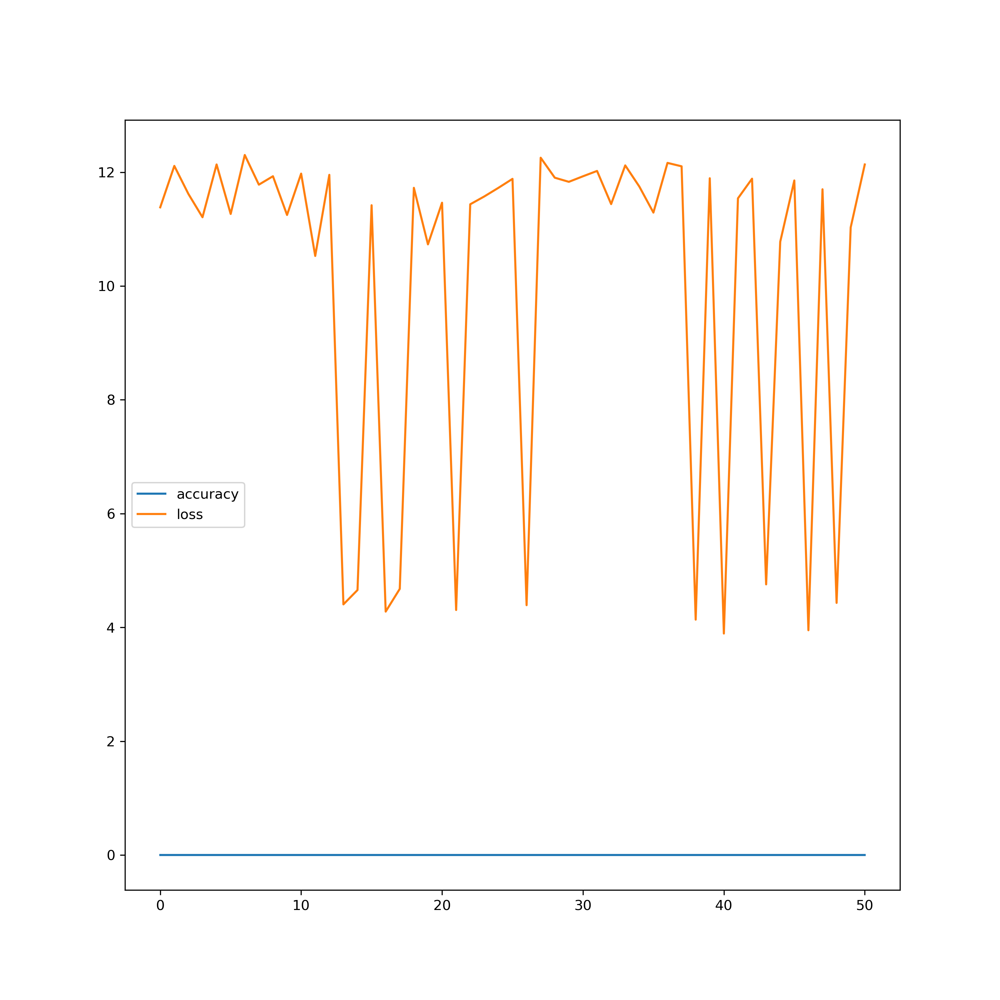
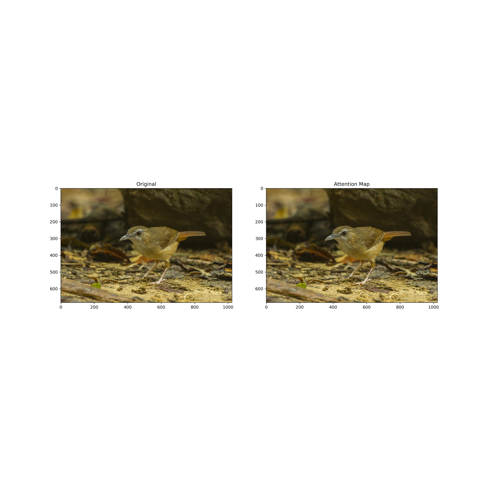
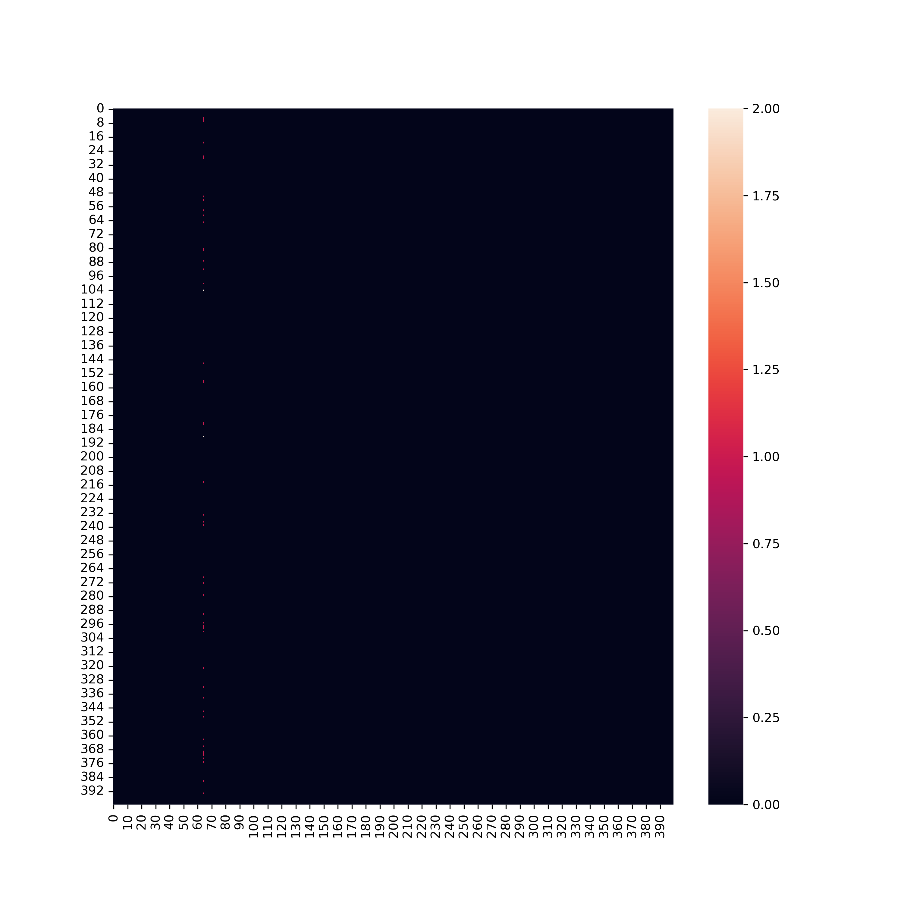

# Vision Transformer using Pytorch

## Setup a deep learning environment with PyTorch on Mac

**Requirements:**
* Apple Silicon Mac (M1, M2, M1 Pro, M1 Max, M1 Ultra, etc).
* macOS 12.3+ 

### Steps

1. Download and install Homebrew from [https://brew.sh](https://brew.sh). Follow the steps it prompts you to go through after installation.
2. [Download Miniforge3](https://github.com/conda-forge/miniforge/releases/latest/download/Miniforge3-MacOSX-arm64.sh) (Conda installer) for macOS arm64 chips (M1, M2, M1 Pro, M1 Max, M1 Ultra).
3. Install Miniforge3 into home directory.

```other
chmod +x ~/Downloads/Miniforge3-MacOSX-arm64.sh
sh ~/Downloads/Miniforge3-MacOSX-arm64.sh
source ~/miniforge3/bin/activate
```

4. Restart terminal.
5. Create a directory to setup PyTorch environment.

```other
mkdir pytorch-test
cd pytorch-test
```

6. Make and activate Conda environment. 

> **Note:** 
> Python 3.8 is the most stable for using the following setup.

```other
conda create --prefix ./env python=3.8
conda activate ./env
```

7. Install the PyTorch 1.12.0+ default version for Mac with pip from the [PyTorch getting started page](https://pytorch.org/get-started/locally/). 


```other
pip3 install torch torchvision torchaudio
```

This will install the following: 
> Installing collected packages: urllib3, typing-extensions, pillow, numpy, idna, charset-normalizer, certifi, torch, requests, torchvision, torchaudio

# Vision Transformer

## Architecture of the model


<!--  -->

## Attention Visualization 



## Confusion Matric


# Usage

## Installation 

## Train

## Running the application 

# References
1. An Image Is Worth 16x16 Words: Transformers For Image Recognition At Scale
2. Are Transformers More Robust Than CNNs?
3. https://www.kdnuggets.com/2022/01/machine-learning-models-die-silence.html
4. https://github.com/jeonsworld/ViT-pytorch 
5. ​​https://gist.github.com/khizirsiddiqui/559a91dab223944fb83f8480715d2582
6. https://github.com/srivatsan88/ContinousModelDeploy 
7. Building MLOps Pipeline for NLP: Machine Translation Task 
8. https://github.com/mrdbourke/pytorch-apple-silicon
