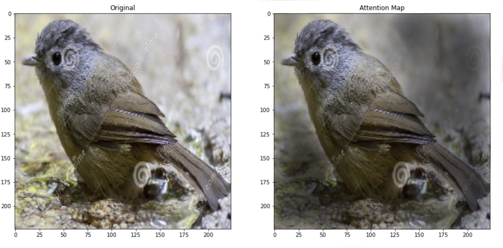
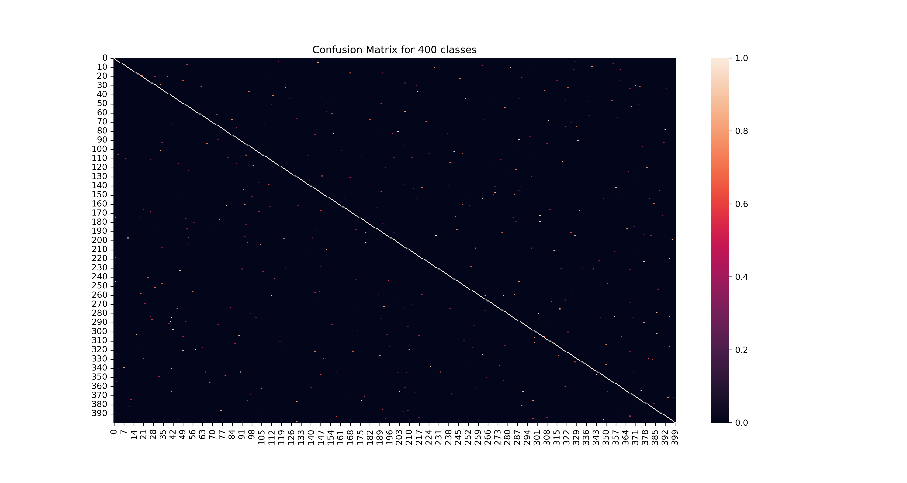

# Vision Transformer using Pytorch

## Setup a machine learning environment with PyTorch on Mac (short version) 

> **Note:** 
> As of June 30 2022, accelerated PyTorch for Mac (PyTorch using the Apple Silicon GPU) is still in beta, so expect some rough edges.

**Requirements:**
* Apple Silicon Mac (M1, M2, M1 Pro, M1 Max, M1 Ultra, etc).
* macOS 12.3+ (PyTorch will work on previous versions but the GPU on your Mac won't get used, this means slower code).

### Steps

1. Download and install Homebrew from [https://brew.sh](https://brew.sh). Follow the steps it prompts you to go through after installation.
2. [Download Miniforge3](https://github.com/conda-forge/miniforge/releases/latest/download/Miniforge3-MacOSX-arm64.sh) (Conda installer) for macOS arm64 chips (M1, M2, M1 Pro, M1 Max, M1 Ultra).
3. Install Miniforge3 into home directory.

```other
chmod +x ~/Downloads/Miniforge3-MacOSX-arm64.sh
sh ~/Downloads/Miniforge3-MacOSX-arm64.sh
source ~/miniforge3/bin/activate
```

4. Restart terminal.
5. Create a directory to setup PyTorch environment.

```other
mkdir pytorch-test
cd pytorch-test
```

6. Make and activate Conda environment. 

> **Note:** 
> Python 3.8 is the most stable for using the following setup.

```other
conda create --prefix ./env python=3.8
conda activate ./env
```

7. Install the PyTorch 1.12.0+ default version for Mac with pip from the [PyTorch getting started page](https://pytorch.org/get-started/locally/). 


```other
pip3 install torch torchvision torchaudio
```

This will install the following: 
> Installing collected packages: urllib3, typing-extensions, pillow, numpy, idna, charset-normalizer, certifi, torch, requests, torchvision, torchaudio




